# BJJ Half Guard - Flowchart & Guidance

Tämä dokumentti on suunniteltu visuaalisen harjoittelun tueksi loukkaantumisen aikana. Tekniikoiden nimet ovat englanniksi ja ohjeet suomeksi.

## Flowchart

Tässä on visuaalinen hahmotelma siitä, miten hyökkäykset haarautuvat Half Guardista kolmeen pääsuuntaan ja mitä swipejä (sweepejä) niistä seuraa.

```mermaid
graph TD
    %% Aloituspositio
    HG[Half Guard]

    %% Uudet lisäykset - Etäisyydenhallinta ja reaktiot
    HG -->|Paine ylhäältä / Etäisyyden pitäminen| KS(Knee Shield / Z-Guard)
    HG -->|Käsien kurotus / Mattoon nojaaminen| KTS(Kimura Trap System)
    HG -->|Vastustaja litistää raskaasti| BHG(Butterfly Half Guard)
    HG -->|Vastustaja nousee seisomaan| RDLR(Reverse De La Riva)

    %% Kolme alkuperäistä pääsuuntaa (lähitaistelu)
    HG -->|Kaiva underhook ja nouse ylös| DF(Dogfight)
    HG -->|Sukella ulommasta kainalosta läpi| OCT(Octopus / Octopus 2.0)
    HG -->|Sukella alle ja kontrolloi etäinen jalka| FLA(Far Leg Attack / Deep Half)

    %% Uusien järjestelmien vaihtoehdot
    KS --> KS1[Arm Drag selkään]
    KS --> KS2[Siirtymä Dogfightiin]
    KS --> KS3[John Wayne Sweep]

    KTS --> KTS1[Kimura Sweep]
    KTS --> KTS2[Roll to the back]
    KTS --> KTS3[Suora lopetus]

    BHG --> BHG1[Butterfly Sweep]
    BHG --> BHG2[Ashi Garami / Single Leg X]

    RDLR --> RDLR1[Kiss of the Dragon]
    RDLR --> RDLR2[Tripod Sweep]

    %% 1. Dogfight vaihtoehdot
    DF --> DF1[Knee Tap Sweep]
    DF --> DF2[Roll Under Sweep]
    DF --> DF3[Back Take]

    %% 2. Octopus vaihtoehdot
    OCT --> OCT1[Back Take]
    OCT --> OCT2[Hip Bump Sweep]
    OCT --> OCT3[Hook Sweep / Roll Under]

    %% 3. Far Leg Attack vaihtoehdot
    FLA --> FLA1[Waiter Sweep]
    FLA --> FLA2[Old School / Homer Simpson Sweep]
    FLA --> FLA3[X-Guard Transition]
```

---

## Ohjeet tekniikoihin ja flow'hun (Guidance)

Tässä on yksityiskohtaisempi erittely siitä, miten kuhunkin positioon päästään, mitä tehdä sen jälkeen ja miten tekniikat suoritetaan.

### 1. Dogfight (Under the hand)

**Miten päästä positioon:**
Kun olet Half Guardissa, pysy kyljelläsi ja älä anna vastustajan litistää selkääsi mattoon.
1. Sukella ulommalla kädelläsi vastustajan painavan käden alta (underhook).
2. Pidä toinen kätesi kontrolloimassa vastustajan toista kättä tai polvea.
3. Vedä jalkasi sisään ja nouse kyynärnojan kautta polvillesi. Nyt olet **Dogfight**-positiossa, jossa molemmat ovat polvillaan ja sinulla on vahva underhook-ote.

**Mitä tehdä Dogfightista (Jatkot):**
- **Knee Tap Sweep:** Jos vastustaja puskee sinua kohti, tavoita vapaalla kädelläsi hänen kauimmaista polveaan. Blokkaa polvi ja aja underhook-kädellä (ja koko vartalollasi) eteenpäin, jolloin vastustaja kaatuu selälleen.
- **Roll Under Sweep:** Jos vastustaja painaa voimakkaasti yläkautta (whizzer) estääkseen noususi, sukella suoraan hänen alleen takaisin mattoon. Pidä tiukasti kiinni hänen jalastaan ja pyörähdä (roll) ympäri, jolloin viet hänet mukanasi ja päädyt päällimmäiseksi.
- **Back Take:** Jos vastustaja vetää painonsa taaksepäin estääkseen sweepin, ota underhook-kätesi pois ja livahda suoraan hänen selkäpuolelleen.

---

### 2. Octopus & Octopus 2.0

**Miten päästä positioon:**
Tämä vaihtoehto toimii erinomaisesti, kun vastustaja yrittää crossface-otetta tai jättää kaukaisemman kainalonsa auki.
1. Sukella kätesi vastustajan selkää pitkin hänen ulomman kainalonsa yli (Octopus grip). Siirrät käytännössä itsesi poikittain hänen selkänsä taakse.
2. **Octopus 2.0:** Laita sisempi jalkasi *butterfly hookiksi* vastustajan jalan sisäpuolelle. Tämän hookin avulla voit nostaa ja keventää vastustajan painoa. Tämä helpottaa lantiosi siirtämistä entistä paremmin hänen selkänsä taakse.

**Mitä tehdä Octopusista (Jatkot):**
- **Back Take:** Koska olet jo valmiiksi vastustajan selkäpuolella, kiipeä suoraan selkään, aseta toinen hookki sisään ja ota seatbelt-kontrolli.
- **Hip Bump Sweep:** Jos vastustaja yrittää peruuttaa estääkseen selkään menon, käytä asemaasi hyväksi. Nouse ylös ja työnnä lantiollasi (hip bump) hänet kumoon.
- **Hook Sweep / Roll Under:** Jos vastustaja yrittää painaa sinut alas, käytä asettamaasi butterfly hookia. Sukella matalammalle, nosta hookilla vastustajan tasapainopiste ilmaan ja pyöräytä hänet ylitsesi.

---

### 3. Far Leg Attack (Going under him)

**Miten päästä positioon:**
Tässä suuntaudutaan sivun sijasta täysin vastustajan painopisteen alle (Deep Half varitaatiot).
1. Kun vastustaja yrittää ohittaa päältä tai antaa painetta eteenpäin, sukella pää edellä hänen jalkojensa vällin tai aivan hänen lantionsa alle.
2. Tavoittele vastustajan kauimmaista jalkaa (Far leg) käsilläsi ja asetu hallitsemaan sitä.
3. Käännä kehosi niin, että pystyt piilottamaan pääsi turvaan ja kannattelemaan hänen painoaan jaloillasi ja lantiosi asennolla.

**Mitä tehdä Far Leg Attackista (Jatkot):**
- **Waiter Sweep:** Nosta vastustajan jalkaa suoraan ylöspäin samalla tavalla kuin tarjoilija kantaa tarjotinta kädellä. Kun hänen painonsa kevenee, käännä lantiotasi jyrkästi ja kaada vastustaja taaksepäin tai sivulle.
- **Old School / Homer Simpson Sweep:** Kurota altapäin kiinni vastustajan sen jalan varpaista, joka on jalkojesi välissä. Kierähdä polvillesi ja kaada hänet eteenpäin tai sivulle pakottamalla säärtä ja varpaita.
- **X-Guard Transition:** Jos sweepit eivät onnistu heti tai vastustaja nousee seisomaan vapaalla jalallaan, työnnä toinen jalkasi hänen jalkojensa väliin ja toinen hänen lantiolleen. Nyt olet X-Guardissa, josta avautuu täysin uusi arsenaali nostoja ja sweepejä.

---

### 4. Knee Shield / Z-Guard (Etäisyydenhallinta)

**Miten päästä positioon:**
Ennen kuin voit rakentaa lähitaistelua, joudut usein puolustamaan painetta.
1. Kun vastustaja antaa painetta ylhäältä, vedä päällimmäinen polvesi hänen rintakehänsä tai hauiksensa eteen esteeksi (Knee Shield).
2. Käytä alempaa jalkaasi kontrolloimaan vastustajan lantiota tai reittä.
3. Säilytä hyvät kehykset (frames) käsilläsi tukeaksesi polven kilpeä.

**Mitä tehdä Knee Shieldistä (Jatkot):**
- **Arm Drag selkään:** Nappaa vastustajan ristikkäisestä hihasta tai ranteesta kiinni, vedä kilpipolven ohi ja nouse nopeasti selkään.
- **Siirtymä Dogfightiin:** Jos vastustaja perääntyy tai menettää tasapainoaan taaksepäin, tiputa Knee Shield alas ja ammu syvä underhook noustaksesi Dogfightiin.
- **John Wayne Sweep:** (Knee Lever) Sulje jalat vastustajan jalan ympärille, tartu vastustajan ristiote-kädestä ja kiepauta hänet kilpipolvellasi sivulle.

---

### 5. Kimura Trap System (Ylävartalon hyökkäykset)

**Miten päästä positioon:**
Vastustaja yrittää raskaalla paineella ohi, roikkuu whizzerissä estääkseen Dogfightisi tai kurottaa kädellään polveasi kohti.
1. Nappaa ranteesta kiinni päänpuoleisella kädelläsi.
2. Vie toinen kätesi hänen käsivartensa yli ja ali tarttuaksesi omaan ranteeseesi vankkaan 2-on-1 otteeseen (Kimura Grip).
3. Lukitse otteesi tiukasti rintaasi vasten, jotta hän ei saa revittyä kättään irti.

**Mitä tehdä Kimura Trapista (Jatkot):**
- **Kimura Sweep:** Samanlainen nosto kuin Hip Bumpissa. Käytä Kimura-otetta vipuvartena kääntääksesi vastustaja selälleen tai viedäksesi hänet yli.
- **Roll to the back / Tarikoplata:** Jos hän puolustaa sweeppiä nojaamalla alaspäin, sujahda alas ja pyörähdä (roll) hänen allaan. Tämä avaa väylän selkään tai Tarikoplata-lukkoon.
- **Suora lopetus:** Monessa tilanteessa, etenkin kun vastustaja nojaa liikaa eteen tai asetat butterfly-hookin avuksi, voit viimeistellä itse Kimuran ilman kaatoa.

---

### 6. Butterfly Half Guard (Nostot ja elevaatio)

**Miten päästä positioon:**
Olet joutunut litteäksi ja vastustaja painaa vahvasti päälle, tehden underhookin tai Knee Shieldin käytön mahdottomaksi.
1. Tee katkarapu (hip escape) riittävästi saadaksesi tilaa ja sujahda ulompi tai sisempi jalkasi vastustajan reiden sisäpuolelle perhoskoukuksi (butterfly hook).
2. Käytä perhoskoukkua aktiivisesti pumppaamaan painetta ja rikkomaan vastustajan asentoa.

**Mitä tehdä Butterfly Halfista (Jatkot):**
- **Butterfly Sweep:** Nappaa underhook ja käden tai pään kontrolli, heittäydy hartiallesi ja nosta vastustajan painopiste suoraan ylitsesi perhoskoukun avulla.
- **Siirtymä Single Leg X (Ashi Garami):** Jos vastustaja pyrkii nousemaan jaloilleen tai tekee basea välttääkseen kaadon, nosta häntä hookilla ja sujahda toinen jalka hänen lantiolleen. Päädyt suoraan vahvaan SLX/Ashi Garami -positioon jalkalukkoja tai sweep & stand up -jatkoja varten.

---

### 7. Reverse De La Riva (RDLR) (Kun vastustaja nousee seisomaan)

**Miten päästä positioon:**
Pelaat Half Guardia, mutta vastustaja ponnistaa pystyyn ja repii oman lantiolinjansa ylös yrittäen ohitusta (esim. Knee Slice tai Torreando).
1. Suojaa itsesi kääntymällä nopeasti hieman selällesi.
2. Vaihda sisempi half guard -hookkisi kietoutumaan hänen seisovan jalkansa ulkopuolelta takareiteen (RDLR hook).
3. Työnnä ulommalla jalalla vastustajan lantiosta estääksesi ohituksen. Kontrolloi vapaalla kädellä hänen kantapäätään tai nilkkaa sisäpuolelta.

**Mitä tehdä RDLR:stä (Jatkot):**
- **Kiss of the Dragon:** Ota tukeva taitto RDLR-hookilla alas, käänny inverted-asentoon suoraan hänen jalkojensa vällin ja kiipeä pitkin jalkaa suoraan selkään (Back Take).
- **Tripod Sweep:** Nappaa ristiote toisesta nilkasta, työnnä lantiolta ja kaada vastustaja yllättävästi pyrstölleen.

---

*Visuaalisen harjoittelun vinkki: Kun luet ja mietit näitä tekniikoita, sulje silmäsi ja kuvittele fyysinen tunne siitä, miten tartut underhookiin, asetat kilven paikalleen tai pyörähdät vastustajan painopisteen alla. Äärimmäinen yksityiskohtien huomiointi mielessä siirtyy nopeutena ja reaktiona matolle.*
