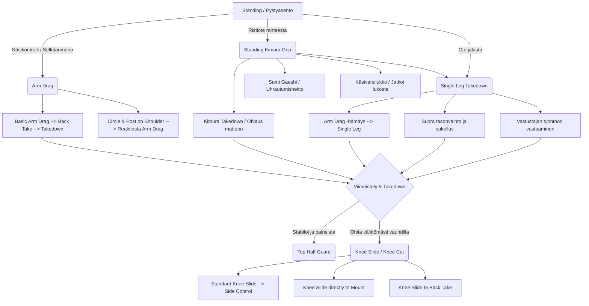

# BJJ Takedown & Standing Game - Flowchart & Guidance

Tämä dokumentti esittelee yksinkertaisen ja tehokkaan pystypainipelin (Standing Game) suunnitelman. Pelikirja nojaa käsivetoihin (Arm Drag), Kimura-otteeseen ja Single Leg -alasvienteihin, ja jatkuu mattoon viennin jälkeen suoraan tehokkaisiin ohituksiin. Tekniikoiden nimet ovat englanniksi ja ohjeet suomeksi.

## Takedown Flowchart

Tässä on visuaalinen hahmotelma pystypainin ydinhyökkäyksistä ja niistä seuraavista alasvienneistä sekä mattoon ohituksista.

---

## Ohjeet tekniikoihin (Guidance)

Tässä on yksityiskohtaisempi erittely aloituksista, jatkoista ja alasviennin jälkeisistä liikkeistä pystypainin hallintaan.

### 1. Arm Drag (Käsiveto)
Käsiveto on nopeampi tapa päästä vastustajan selkäpuolelle ja välttää voimapainia.

- **Basic Arm Drag:** Ota ristiote vastustajan ranteesta. Kirota toisella kädelläsi samanaikaisesti hänen ojentajaansa tai aivan kainalonsa taakse. Nykäise hänet ohi itsestäsi ja astu välittömästi hänen selkäpuolelleen. Nappaa Seatbelt-ote ja tee alasvienti takaa.
- **Circle & Post on Shoulder (Reaktion hakeminen):** Liiku aktiivisesti sivulle ja paina (post) kädelläsi vastustajan taemman olkapään taakse estääksesi häntä kääntymästä vapaasti tai pakottaaksesi tietyn liikkeen. Kun hän yrittää kääntää rintamasuuntansa sinuun päin tai poistaa kätesi puolustavalla kädellä ("start doing something with their hand"), nappaa välittömästi hänen puolustavasta kädestään kiinni ranteesta ja tee Arm Drag (yllä mainittu liike). Tämä on erinomainen tapa luoda ennalta-arvattava reaktio (kuzushi).

### 2. Standing Kimura Grip
Erittäin vahva 2-on-1 ote, joka riisuu vastustajan hyökkäysvoiman ja antaa sinulle lukuisia hyökkäysvaihtoehtoja.

- **Miten ote haetaan:** Ota **oikealla kädelläsi vastustajan oikeasta ranteesta kiinni** (ristiote / cross-grip). Vie sen jälkeen **vasen kätesi** ylitse jaalitse vastustajan käden, ja ota kiinni omasta oikeasta ranteestasi. Nyt sinulla on tiukka lukkokahva (Kimura Grip). Pidä kädet tiukasti kiinni omassa rinnassasi.
- **Kimura Takedown:** Kun ote on kiinni rinnassasi, voit ohjata vastustajan asennon rikki kääntämällä koko kehoasi ja painamalla hänen olkapäätään kohti mattoa. Vastustaja rullaa usein suoraan alleen tai putoaa kilpikonnaan (Turtle).
- **Sumi Gaeshi:** Jos vastustaja vastustaa alaspäin vientiä ja nostaa painopistettään ylöspäin päästäkseen irti, hyödynnä hänen voimaansa: istu suoraan hänen allensa pudottaen painosi mattoon, aseta toisen tai molempien jalkojesi perhoskoukut (butterfly hooks) ja heitä (sweep) hänet kauniisti pääsi yli.
- **Käsivarsilukko ja Single Leg -hämäykset:** Kimura-otteesta voit myös hypätä/ohjata suoraan käsilukkoon (Armlock). Voit myös vaihtoehtoisesti repäistä käden alas painopisteen laskemiseksi ja syöksyä yllättäen Single Leg -alasvientiin.

### 3. Single Leg Takedown (Yhden jalan alasvienti)
Tehokas ja riskitön takedown-vaihtoehto, joka on helppo ketjuttaa yhteen ylävartalohyökkäysten kanssa.

- **Entries (Sisääntulot):**
  1. *Suora tasonvaihto.* Joustetaan polvista ja sukelletaan suoraan etummaiseen jalkaan kiinni, pää sisäpuolella suojaamassa giljotiinilta.
  2. *Arm Drag -hämäys.* Aloita käsiveto, mutta kun vastustaja vetää pelästyneenä kättään takaisin (siirtäen painonsa tukevasti etummaiseen jalkaansa), tasonvaihda nopeasti ja sukella hänen jalkaansa kiinni.
  3. *Kimura-otteesta laskiutuminen.* Kuten yllä mainittiin, kun ylävartalossa tapahtuu taistelu, jalat jäävät yleensä vapaaksi hyökkäykselle.

### 4. Alasviennin jälkeiset ohitukset (Takedown Finish & Passing)
Mitä tapahtuu välittömästi, kun olet saanut vietyä vastustajan mattoon. Tällöin päätät, otatko position vakaasti haltuun vai "leikkaatko" välittömästi liikkeen tuomalla vauhdilla ohi.

- **Siirtymä (Top) Half Guardiin:**
  Kun olet kaatanut vastustajan Single Legistä, pudotaudut tarkoituksella suoraan ohjaamaan hänen lonkkiaan ottaen Half Guardin päältä (Top Half Guard). Tämä stabiloi tilanteen, estää häntä karkaamasta nopeasti scarmbleen ja antaa sinulle vahvan päältäkontrolloitavan position, josta voit rakentaa hidasta ja musertavaa ohituspeliä tai sulkea Kimura/Darce -ansat.

- **Ohitus Knee Slide / Knee Cut -tekniikoilla:**
  Tämä on toinen vahva vaihtoehto suoraan kaadon jatkoksi: pudotetun vastustajan puolinta on yritettävä leikata välittömästi, ennen kuin hän on ehtinyt palauttaa suojiaan (frames).
  1. **Standardi Knee Slide:** Kaadon jälkeen ohjaa toinen polvesi voimakkaasti läpi hänen reitensä ja lantionsa välistä. Nappaa tiukka ristiote (crossface) estääksesi hänen kääntymisensä kohti, liu'u läpi ja ota Side Control haltuun.
  2. **Knee Slide to Mount:** Jos vastustajan on jättänyt lantionsa vapaaksi eikä estä jaloillaan polvesi kulkua, voit liu'uttaa Knee Cutia suoraan pitkin reittä ja napata lantion yli suoraan Mounttiin ilman Side Controlin välietappia.
  3. **Knee Slide Back Take (Twister Hook / Roling):** Kun leikkaat Knee Slidellä ja vastustaja kääntää epätoivoisesti selkänsä kohti (kuitenkin yrittäen ylös tai pois alta), liu'u suoraan hänen selkänsä taakse, pujota lähempään jalkaan hookki (Twister hook tai normi) ja vie käsi välittömästi Seatbeltiin kaataaksesi hänet kokonaan ja varmistaaksesi selän.
